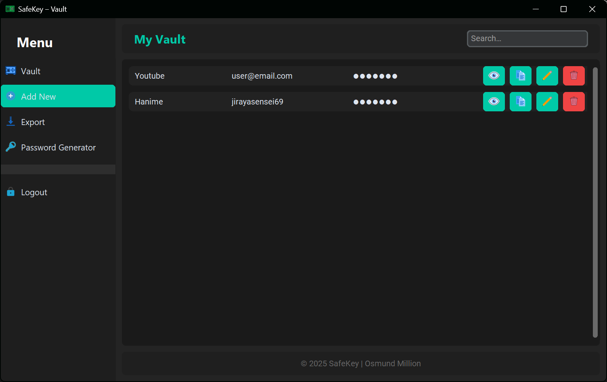
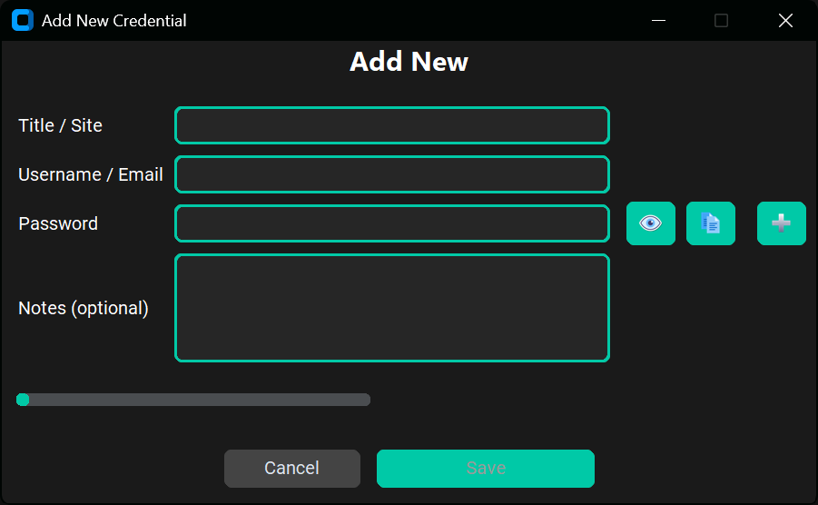
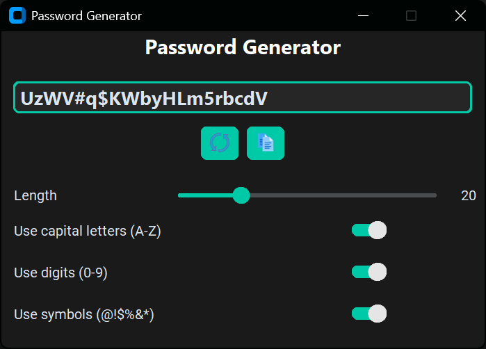

# 🔐 SafeKey – Simple Offline Password Vault


**SafeKey** is a sleek, local-only desktop application for managing your credentials, built with Python and CustomTkinter. It allows you to store passwords, notes, and usernames securely with AES-GCM encryption, protected by a master password.

> ⚠️ **Disclaimer**  
> This project is for educational or personal offline use only. **SafeKey is *not* an official password manager.**  
> If you need secure, audited protection for sensitive data, we recommend using well-established tools like Bitwarden, 1Password, or KeePassXC.

---

## 🧩 Features

- Master password setup and verification using PBKDF2-HMAC-SHA256
- AES-GCM encryption for all stored passwords
- Credential management (add/edit/delete/search)
- Password strength indicator
- Built-in secure password generator
- Export credentials to CSV
- Lightweight and works fully offline

---

## 📸 Screenshots

  
  
  
  
  

---

## 🚀 Getting Started

### 🔧 Requirements

- Python 3.9+
- Install dependencies:
  ```bash
  pip install -r requirements.txt
  ```

### ▶️ Run the App

```
python main.py
```

### 📁 Project Structure

```
/safekey
├── main.py
├── requirements.txt
├── /gui
│   ├── screens/              # Login, Setup, Dashboard screens
│   ├── widgets/              # Sidebar, Toast, CredentialRow, etc.
├── /encryption               # AES encryption + key derivation
├── /database                 # SQLite manager
├── /assets                   # Icons, images, and screenshots
└── /data                     # Encrypted local DB + master key
```

---

## 🛡️ Security Notes

All data is stored locally in:

- `data/vault.db` → encrypted credential database  
- `data/master.key` → hashed master password (with salt)

Passwords are encrypted using AES-GCM before being stored and decrypted in memory only after successful login.

> **Note**: There is no recovery mechanism. If you forget your master password, the vault becomes permanently inaccessible by design.

---

## 📄 License

MIT License

---

## 👤 Author

Built by **Osmund Million** – 2025  
Happy coding, and stay secure! 🛡️
